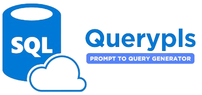

[](https://github.com/psf/black) 
[](LICENSE)


# 💬 Querypls - Prompt to SQL 

Querypls is a web application that provides an interactive chat interface, simplifying SQL query generation. Users can effortlessly enter SQL queries and receive corresponding results. The application harnesses the capabilities of the language models from Hugging Face to generate SQL queries based on user input.

## Key Features

💬 Interactive chat interface for easy communication.  
🔍 Enter SQL queries and receive query results as responses.  
🤖 Utilizes language models from Hugging Face for advanced query generation ([Querypls-prompt2sql](https://huggingface.co/samadpls/querypls-prompt2sql)).  
💻 User-friendly interface for seamless interaction.  
🔒 Secure Google Authentication for OAuth2 integration.  
🔄 Chat history recording for easy reference.

[QueryplsDemo.webm](https://github.com/samadpls/Querypls/assets/94792103/7fcd6608-c8e0-4ba2-8166-5d4021adeb69)


## How to Contribute

1. Clone the repository:
    ```bash
    git clone https://github.com/samadpls/Querypls.git
    ```

2. Navigate to the project directory:
    ```bash
    cd Querypls
    ```

3. Install dependencies:
    ```bash
    pip install -r requirements.txt
    ```

4. Create a `.env` file based on `.env_example` and set the necessary variables.

5. Run the application:
    ```bash
    streamlit run app.py
    ```

6. Open the provided link in your browser to use Querypls.

## License

This project is licensed under the MIT License. See the [LICENSE](LICENSE) file for details.

---

`Made with 🤍 by samadpls`
